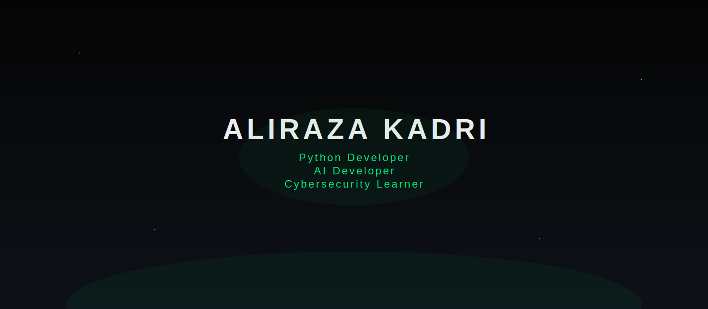

<!-- ========================= -->
<!--      ALIRAZA KADRI       -->
<!-- ========================= -->

<div align="center">



# Aliraza Kadri

### Python Developer • AI Developer • Cybersecurity Learner

<p>

</p>

[](https://github.com/aliraza2022)
[](https://www.linkedin.com/in/kadri-aliraza-09376924b)
[](mailto:alirazakadri63@gmail.com)

</div>

---

# 👨‍💻 About Me

```yaml
Name: Aliraza Kadri

Role:
  - Python Developer
  - AI Developer
  - Cybersecurity Learner

Location:
  Ahmedabad, Gujarat, India

Currently Learning:
  - Kali Linux
  - Linux
  - Cybersecurity

Goal:
  Build AI-powered applications and secure software.
```

---

# 🛠 Tech Stack

### Languages

<p>

</p>

### Frontend

<p>


</p>

### Backend

<p>

</p>

### Tools

<p>

</p>

---

# 📊 GitHub Stats

<div align="center">


<br><br>


</div>

---

# 🚀 Featured Projects

## 🤖 AI Document Intelligence Platform

Python • Flask • Gemini API

AI powered document processing system.

---

## 💰 Crypto Tracker

Python • JavaScript

Real-time cryptocurrency tracker.

---

## 🌐 Portfolio Website

Coming Soon...

---

# 🌱 Currently Learning

- Kali Linux
- Linux
- Cybersecurity
- AI

---

# 📫 Contact

- 📧 alirazakadri63@gmail.com

- 💼 https://www.linkedin.com/in/kadri-aliraza-09376924b

- 💻 https://github.com/aliraza2022

---

<div align="center">

### ⭐ Thanks for visiting my profile ⭐

</div>
